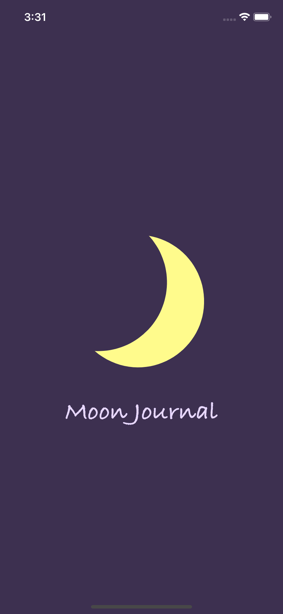
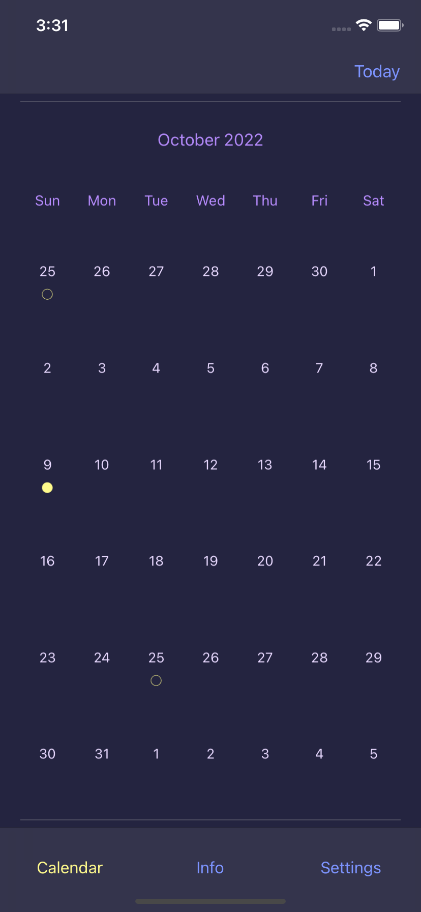
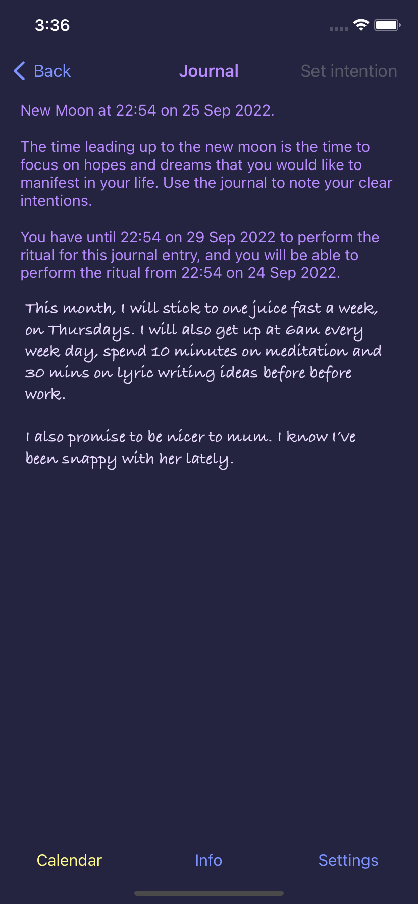
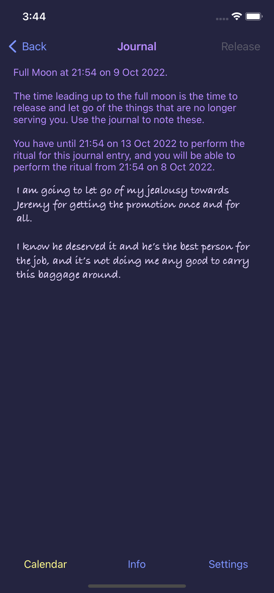
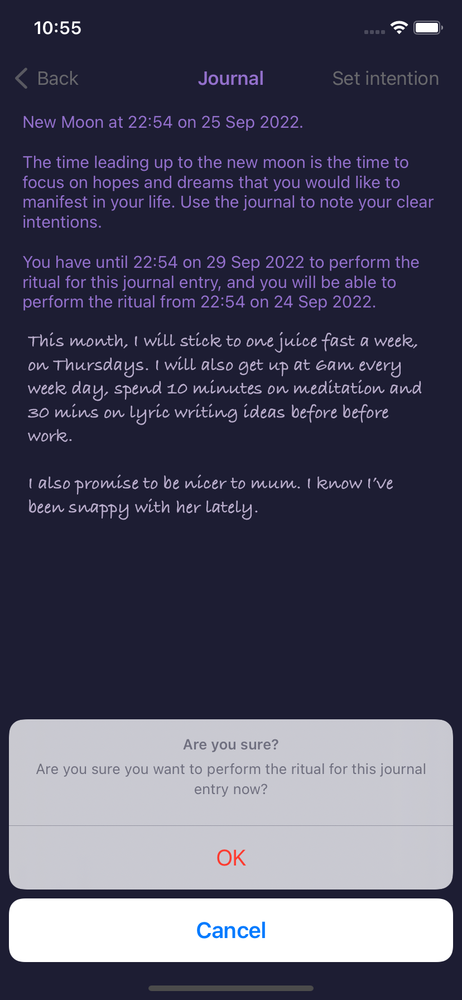
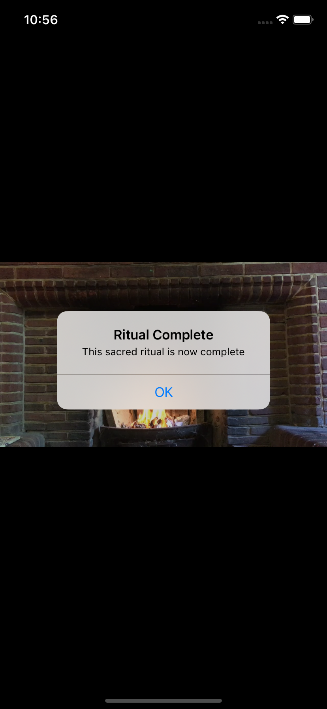

# Moon Journal

An iOS calendar based app to enable a virtual version of a 'moon ritual', in which the user releases their hopes/dreams and sets their intentions at the time of a new or full moon.

<b>Harness the power of the moon!</b>

The new moon is a time to focus on manifesting our hopes and dreams, and the full moon is a time to let go of the baggage that no longer serves us in our lives.

  
 
The Moon Journal app allows the user to perform a virtual version of an ancient ritual. They can use the Moon Journal app to note their innermost thoughts and feelings around the time of a new moon or a full moon, and perform a sacred ritual to harness the influence of the new or full moon.

 
 
In the real-world ritual, you write down your intentions and goals at the time of a new moon, or the negative baggage that you want to release at the time of a full moon, and burn the piece of paper to perform the ritual. The app allows you to perform a virtual version of a ritual - very handy if you live in a flat, for example!

<b>How to use the app</b>

 
 
 
 
 
 
 
 

New moons and full moons are shown in the app’s calendar using the two symbols.

There is a journal page for each new moon and full moon, which the user can enter by selecting the relevant date.

The user receives a notification three days before each new or full moon. This is the time when the energy of the moon starts to take effect, and to decide on your focus for the forthcoming ritual. The user receives a second notification on the date and time of the actual full or new moon.

The user can perform the ritual from twenty-four hours ahead of the time of the new or full moon, and for up to three days afterwards. This is the period of peak moon energy, and at this time the date on the Moon Journal calendar will be highlighted in yellow. The ‘Set Intention’ or ‘Release’ button within the journal entry itself will become active during the time of peak moon energy. Perform the ritual by selecting this button.

The text entered into the journal will be cleared after the ritual has been performed.

This app makes use of the FSCalendar library, courtesy of Wenchao Ding.

Copyright (c) 2013-2016 FSCalendar (https://github.com/WenchaoD/FSCalendar)

